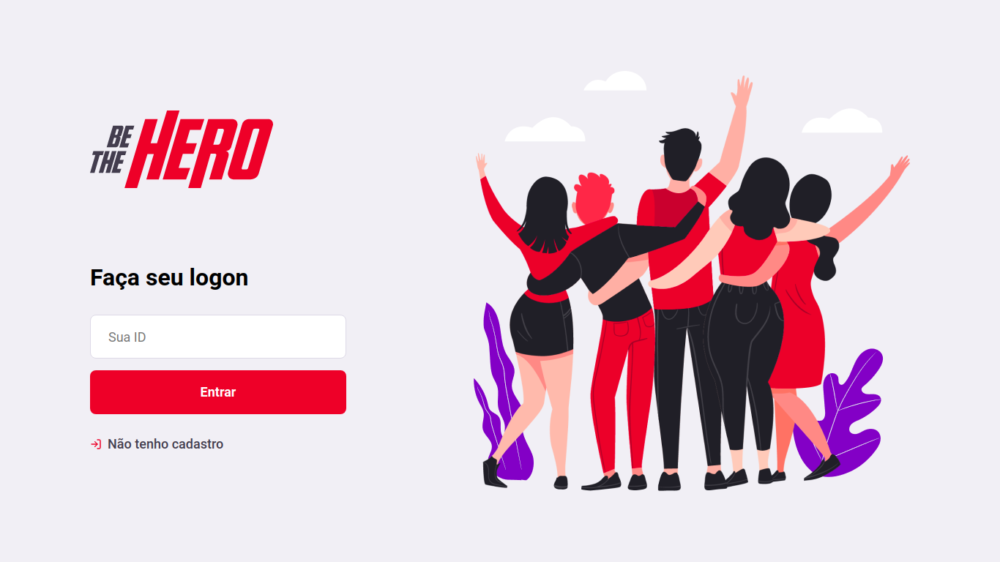
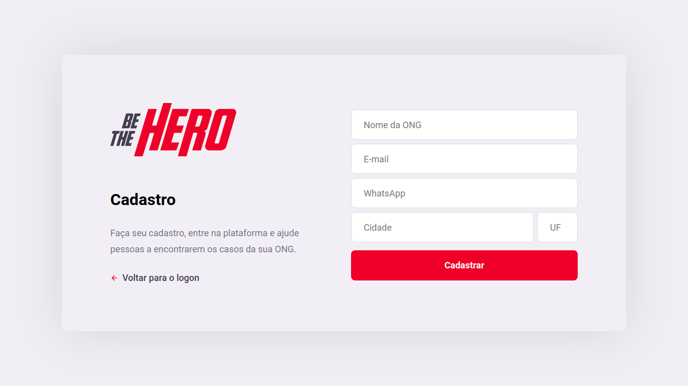
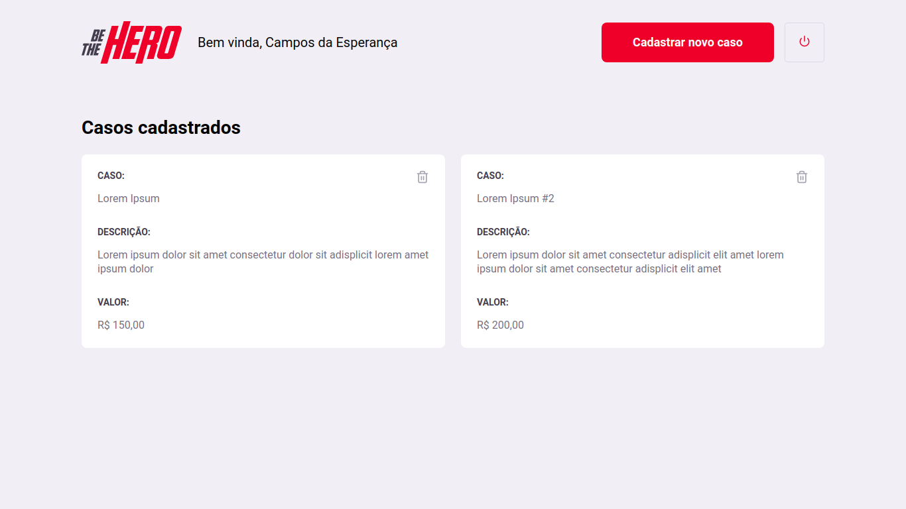

<h1 align="center">
 
  
 
 
Be The Hero
</h1>

Seu marketplace de coleta de resíduos

  

  

# :computer: Web

    

 
 

# :iphone: Mobile

  

## :rocket: Tecnologias

### Esse app foi desenvolvido com:

- ⚛️ **React Js**
- ⚛️ **React Native com expo**
- 💹 **Node Js com express**
- 📄 **SQLite3**
- ♻️ **Knex**

## Instalação

1. No diretório principal do repositório, vá até o arquivo `api.js`, no diretório `src/mobile/services`, e substitua o campo `[LOCAL_IP]` pelo IP do seu computador.

### Back-End (API)

1. No diretório principal do repositório, rode: `cd backend`
2. Instale as dependências utilizando o `yarn`, ou o seu gerenciador de pacotes preferido.
3. Rode o comandos `yarn knex:migrate`
4. Rode o comando `yarn start`

### Front-End

1. No diretório principal do repositório, rode: `cd frontend`
2. Instale as dependências utilizando o `yarn`, ou o seu gerenciador de pacotes preferido.
3. Rode o comando `yarn start` para iniciar a aplicação web

### Mobile

1. No diretório principal do repositório, rode: `cd mobile`
2. Instale as dependências utilizando o `yarn`, ou o seu gerenciador de pacotes preferido.
3. Rode o comando `yarn start` para iniciar o Expo.
4. No seu smartphone, instale o aplicativo `Expo`, da sua loja de aplicativos.
5. No aplicativo, escaneie o QR code gerado no Expo Developer Tools/terminal.

## License

This project is licensed under the MIT License - see the [LICENSE](https://opensource.org/licenses/MIT) page for details.

###### Desenvolvido durante a Semana Omnistack 11, ministrada pela [RocketSeat](https://rocketseat.com.br) :rocket: